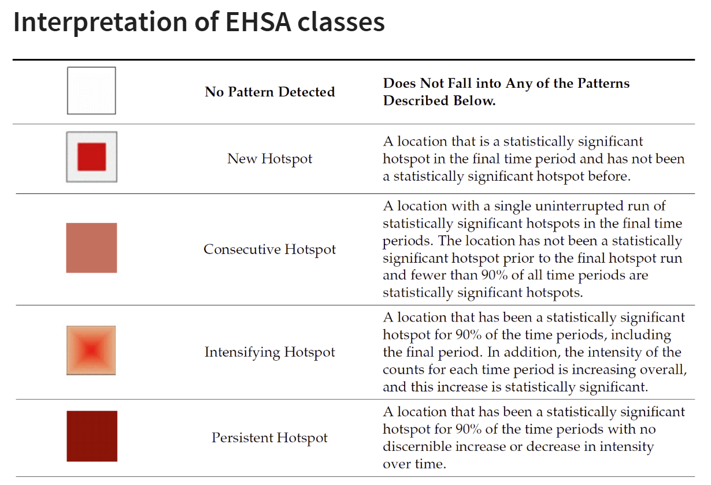
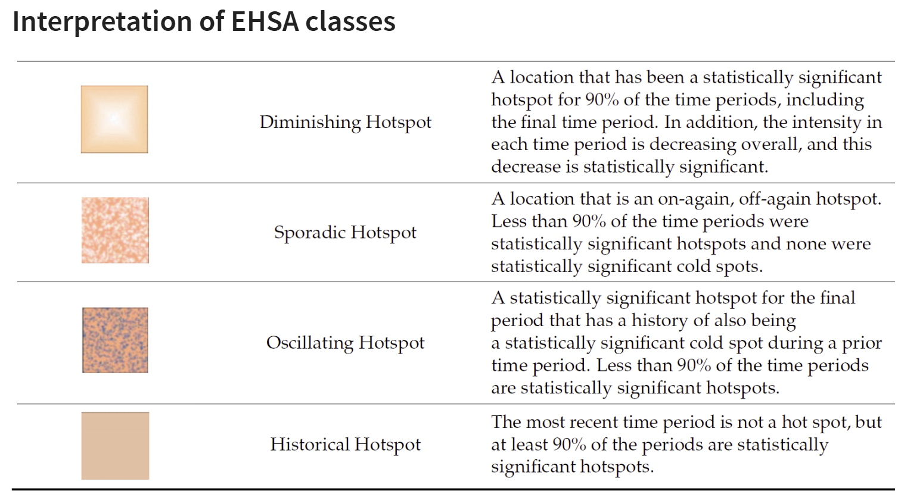
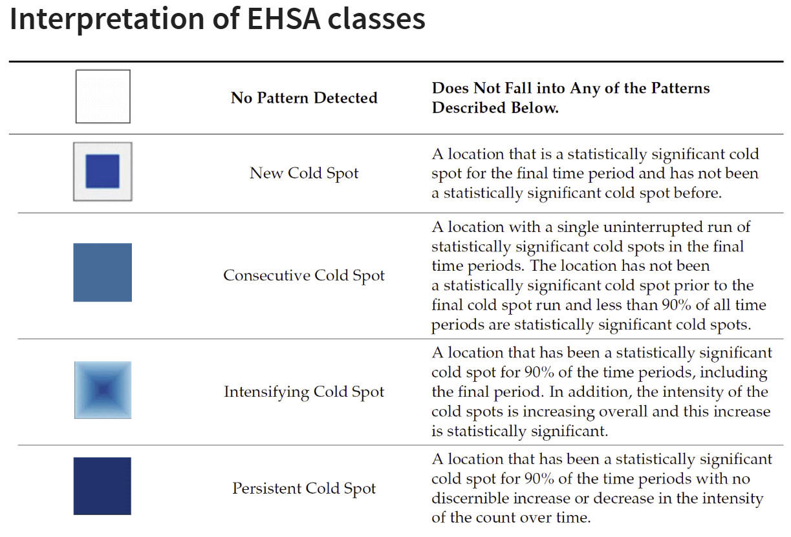
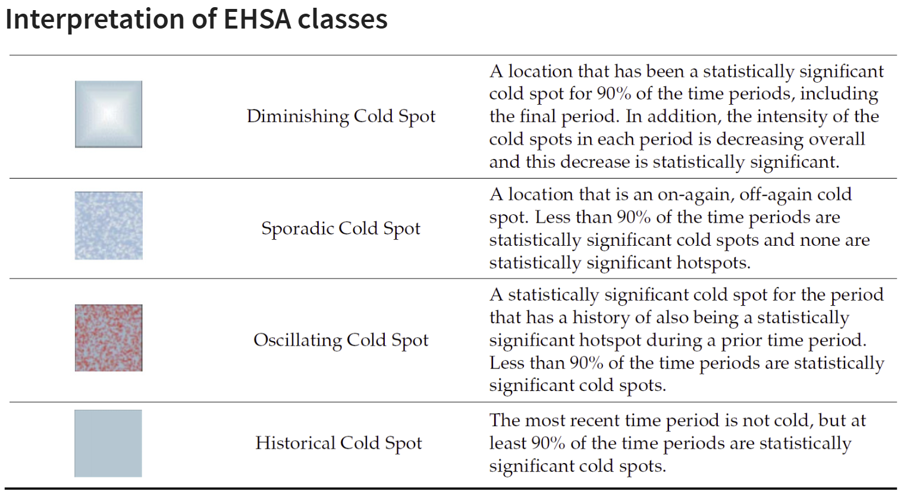

## Global and Local measures of spatial autocorrelation using sfdep package

### Overview

In this exercise, we will use the **sfdep** package to perform global and local measures of spatial autocorrelation using Hunan's spatial data. In Hands-on Exercise 5, we learnt to perform spatial autocorrelation using **spdep** package.

::: callout-note
The **sfdep** and **spdep** packages in R are both designed for spatial data analysis, particularly focusing on spatial autocorrelation, but they differ in their approach and compatibility with modern R data structures.

-   **spdep**: This is the older and more established package for spatial dependence analysis in R. It provides functions for creating spatial weights, spatial lag models, and global and local spatial autocorrelation statistics such as Moran's I. However, **spdep** was originally built to work with the `sp` package, which uses the older `Spatial*` classes for handling spatial data.

-   **sfdep**: This is a newer package designed to work seamlessly with the **sf** package, which has become the standard for handling spatial data in R using simple features. **sfdep** provides an interface for spatial dependence analysis that is compatible with **sf**'s `sf` objects (simple feature geometries) and makes extensive use of **tidyverse** conventions, such as list columns, which allow for more flexible and tidy manipulation of spatial data.

#### Key Differences:

1.  **Data Structures**:

    -   **spdep** works with `Spatial*` objects from the `sp` package.
    -   **sfdep** works with `sf` objects from the `sf` package, which are easier to integrate with modern R workflows and the tidyverse ecosystem.

2.  **Integration**:

    -   **sfdep** is more compatible with modern workflows using the **tidyverse**, allowing for easier manipulation of data within data frames and list columns.
    -   **spdep** relies on the older base R style and is less intuitive when working with modern data pipelines.

3.  **Functionality**:

    -   Both packages provide similar functionalities for spatial autocorrelation, such as computing Moran's I and local Moran's I.
    -   **sfdep** introduces new functionalities that leverage list columns for easier spatial dependence operations.

**sfdep can essentially be considered a wrapper around the functionality provided by spdep, designed to work with the modern sf (simple features) framework for spatial data in R.**
:::

### Learning Outcome

-   Perform global Moran's I test for spatial autocorrelation.
-   Compute and visualize local Moran's I and Gi\* statistics for identifying clusters and outliers.
-   Create choropleth maps to display the results of spatial autocorrelation analysis.

### Import the R Packages

The following R packages will be used in this exercise:

| **Package** | **Purpose** | **Use Case in Exercise** |
|-----------------|------------------------------|-------------------------|
| **sf** | Handles spatial data; imports, manages, and processes vector-based geospatial data. | Importing and managing geospatial data, such as Hunan's county boundary shapefile. |
| **sfdep** | Provides functions for spatial autocorrelation, including Moran's I and local Moran's I. | Performing spatial autocorrelation analysis with global and local measures. |
| **tidyverse** | A collection of R packages for data science tasks like data manipulation, visualization, and modeling. | Wrangling aspatial data and joining with spatial datasets. |
| **tmap** | Creates static and interactive thematic maps using cartographic quality elements. | Visualizing spatial analysis results and creating thematic maps. |

To install and load these packages, use the following code:

```{r}
pacman::p_load(sf, sfdep, tmap, tidyverse)
```

### The Data

The following datasets will be used in this exercise:

| **Data Set** | **Description** | **Format** |
|-----------------|---------------------------------------|-----------------|
| **Hunan County Boundary Layer** | A geospatial dataset containing Hunan's county boundaries. | ESRI Shapefile |
| **Hunan_2012.csv** | A CSV file containing selected local development indicators for Hunan in 2012. | CSV |

```{r}
hunan <- st_read(dsn = "data/geospatial",
                 layer = "Hunan")
glimpse(hunan)
```

::: callout-tip
For admin boundaries, we will typically encounter **polygon or multipolygon** data objects.

A polygon represents a single contiguous area, while a multipolygon consists of multiple disjoint areas grouped together (e.g., islands that belong to the same admin region).
:::

```{r}
hunan2012 <- read_csv("data/aspatial/Hunan_2012.csv")
glimpse(hunan2012)
```

::: callout-note
Recall that to do left join, we need a common identifier between the 2 data objects. The content must be the same eg. same format and same case. In Hands-on Exercise 1B, we need to (PA, SZ) in the dataset to uppercase before we can join the data.
:::

```{r}
hunan <- left_join(hunan,hunan2012) %>%
  select(1:4, 7, 15)
glimpse(hunan)
```

### Visualising Choropleth Map of GDPPC of Hunan

To plot a choropleth map showing the distribution of GDPPC of Hunan province:

```{r hunan_choropleth}
#| fig-width: 9
#| fig-height: 7
tmap_mode("plot")
tm_shape(hunan) +
  tm_fill("GDPPC",
          style = "quantile",
          palette = "Blues",
          title = "GDPPC") +
  tm_layout(main.title = "Distribution of GDP per capita by county, Hunan Province",
            main.title.position = "center",
            main.title.size = 1.2,
            legend.height = 0.45,
            legend.width = 0.35,
            frame = TRUE) +
  tm_borders(alpha = 0.5) +
  tm_compass(type="8star", size = 2) +
  tm_scale_bar() +
  tm_grid(alpha =0.2)

```

### Global Measures of Spatial Association

#### Deriving Queen's contiguity weights: sfdep methods

To derive the Queen's contiguity weights:

```{r}
wm_q <- hunan %>%
  mutate(nb = st_contiguity(geometry),
         wt = st_weights(nb,
                         style = "W"),
         .before = 1)

```

::: callout-tip
Notice that `st_weights()` provides tree arguments, they are:

-   *nb*: A neighbor list object as created by st_neighbors().
-   *style*: Default "W" for row standardized weights. This value can also be "B", "C", "U", "minmax", and "S". B is the basic binary coding, W is row standardised (sums over all links to n), C is globally standardised (sums over all links to n), U is equal to C divided by the number of neighbours (sums over all links to unity), while S is the variance-stabilizing coding scheme proposed by Tiefelsdorf et al. 1999, p. 167-168 (sums over all links to n).
-   *allow_zero*: If TRUE, assigns zero as lagged value to zone without neighbors.
:::

#### Computing Global Moran' I

We will use [`global_moran()`](https://sfdep.josiahparry.com/reference/global_moran) function to compute the Moran’s I value.

```{r}
moranI <- global_moran(
  wm_q$GDPPC, # Target variable: GDP per capita
  wm_q$nb, # Neighborhood structure
  wm_q$wt # Spatial weights
)

glimpse(moranI)

```

::: callout-tip
Unlike the `spdep` package, the output of the `global_moran()` function is a tibble data frame, making it easier to work with in the tidyverse environment.
:::

### Performing Global Moran's I Test

::: callout-tip
Previously, we calculated the Moran's I statistic using the `global_moran()` function. However, this approach does not allow for formal hypothesis testing, as it only returns the Moran's I value, not the associated p-value or significance level. Therefore, we cannot determine whether spatial autocorrelation is statistically significant with this method.
:::

To conduct a proper hypothesis test, we need to use the `global_moran_test()` function from the `sfdep` package, which computes the Moran's I statistic and also performs a permutation-based significance test. This allows us to assess whether the observed spatial autocorrelation is significantly different from what would be expected under spatial randomness.

The following code demonstrates how to perform the Moran's I test:

```{r}
global_moran_test(
  wm_q$GDPPC, # Target variable: GDP per capita
  wm_q$nb, # Neighborhood structure
  wm_q$wt # Spatial weights
)
```

::: callout-tip
-   The default for `alternative` argument is "two.sided". Other supported arguments are "greater" or "less". randomization, and
-   By default the `randomization` argument is **TRUE**. If FALSE, under the assumption of normality.
:::

This method not only calculates the Moran's I statistic but also provides a p-value for assessing the significance of the spatial autocorrelation.

::: callout-note
**Observations:**

-   **Moran's I statistic:** 0.301, indicating moderate positive spatial autocorrelation.
-   **P-value:** 1.095e-06, highly significant, confirming strong evidence of positive spatial autocorrelation.
:::

### Perfoming Global Moran's I Permutation Test

In practice, a Monte Carlo simulation should be used to perform the statistical test. In the `sfdep` package, this is supported by the `global_moran_perm()` function.

To ensure that the computation is reproducible, we will use `set.seed()` before performing simulation.

```{r}
set.seed(1234)
```

Now we will perform Monte Carlo simulation using `global_moran_perm()`.

```{r}
global_moran_perm(wm_q$GDPPC,
                  wm_q$nb,
                  wm_q$wt,
                  nsim = 99)
```

::: callout-note
**Observations:**

The statistical report on previous tab shows that the p-value is smaller than alpha value of 0.05. Hence, we have enough statistical evidence to reject the null hypothesis that the spatial distribution of GPD per capita are resemble random distribution (i.e. independent from spatial). Because the Moran's I statistics is greater than 0. We can infer that the spatial distribution shows sign of clustering.
:::

### Local Measures of Spatial Association

### LISA Map

LISA map is a categorical map showing **outliers** and **clusters**. There are two types of outliers namely: High-Low and Low-High outliers. Likewise, there are two type of clusters namely: High-High and Low-Low cluaters. In fact, LISA map is an interpreted map by combining local Moran's I of geographical areas and their respective p-values.

### Computing Local Moran's I

In this section, we will compute Local Moran's I of GDPPC at county level by using [`local_moran()`](https://sfdep.josiahparry.com/reference/local_moran.html) of sfdep package.

```{r}
lisa <- wm_q %>%
  mutate(local_moran = local_moran(
    GDPPC, nb, wt, nsim = 99),
         .before = 1) %>%
  unnest(local_moran)
```

::: callout-tip
-   We use `unnest()` in this context to convert the nested list column created by `local_moran()` into multiple rows, one for each simulation result per observation.
-   The `local_moran()` function from the `sfdep` package returns a nested list, with each element containing the results of local Moran’s I statistic for each spatial unit.
-   Unnesting helps in expanding this list into individual rows, making each result (e.g., local Moran’s I values, p-values) accessible in a tidy, flat data frame format.
-   This step is crucial for easier manipulation, filtering, and visualization of the spatial autocorrelation results, allowing us to work with the data in a more intuitive and flexible way.

Thus, `unnest()` is applied to handle and process the simulation results efficiently.

------------------------------------------------------------------------

The output of `local_moran()` is a sf data.frame containing the columns ii, eii, var_ii, z_ii, p_ii, p_ii_sim, and p_folded_sim.

-   ii: local moran statistic
-   eii: expectation of local moran statistic; for localmoran_permthe permutation sample means
-   var_ii: variance of local moran statistic; for localmoran_permthe permutation sample standard deviations
-   z_ii: standard deviate of local moran statistic; for localmoran_perm based on permutation sample means and standard deviations p_ii: p-value of local moran statistic using pnorm(); for localmoran_perm using standard deviatse based on permutation sample means and standard deviations p_ii_sim: For `localmoran_perm()`, `rank()` and `punif()` of observed statistic rank for \[0, 1\] p-values using `alternative=` -p_folded_sim: the simulation folded \[0, 0.5\] range ranked p-value (based on https://github.com/pysal/esda/blob/4a63e0b5df1e754b17b5f1205b cadcbecc5e061/esda/crand.py#L211-L213)
-   skewness: For `localmoran_perm`, the output of e1071::skewness() for the permutation samples underlying the standard deviates
-   kurtosis: For `localmoran_perm`, the output of e1071::kurtosis() for the permutation samples underlying the standard deviates.
:::

### Visualising Local Moran's I and p-value

When interpreting / visualizing local Moran's I, we should plot the Moran's I and p-value side by side.

```{r, local_moran_i_p_value, fig.height=8, fig.width=12}
tmap_mode("plot")
map1 <- tm_shape(lisa) +
  tm_fill("ii") +
  tm_borders(alpha = 0.5) +
  tm_view(set.zoom.limits = c(6,8)) +
  tm_layout(
    main.title = "Local Moran's I of GDPPC",
    main.title.size = 0.8
  )

map2 <- tm_shape(lisa) +
  tm_fill("p_ii") +
  tm_borders(alpha = 0.5) +
  tm_view(set.zoom.limits = c(6,8)) +
  tm_layout(
    main.title = "p-value of Local Moran's I",
    main.title.size = 0.8
  )

tmap_arrange(map1, map2, ncol = 2)
```

#### Plotting LISA Map

In lisa sf data.frame, we can find three fields contain the LISA categories. They are *mean*, *median* and *pysal*. In general, classification in *mean* will be used as shown in the code below.

```{r, lisa_map}
lisa_sig <- lisa  %>%
  filter(p_ii_sim < 0.05)
tmap_mode("plot")
tm_shape(lisa) +
  tm_polygons() +
  tm_borders(alpha = 0.5) +
tm_shape(lisa_sig) +
  tm_fill("mean") +
  tm_borders(alpha = 0.4)
```

### Hot Spot and Cold Spot Area Analysis

Hot Spot and Cold Spot Analysis (HCSA) uses spatial weights to identify locations of statistically significant hot spots and cold spots within a spatially weighted attribute. These spots are identified based on a calculated distance that groups features when similar high (hot) or low (cold) values are found in proximity to one another. The polygon features typically represent administrative boundaries or a custom grid structure.

#### Computing local Gi\* statistics

As usual, we will need to derive a spatial weight matrix before we can compute local Gi\* statistics. Code chunk below will be used to derive a spatial weight matrix by using sfdep functions and tidyverse approach.

```{r}
wm_idw <- hunan %>%
  mutate(nb = include_self(
    st_contiguity(geometry)),
    wts = st_inverse_distance(nb,
                              geometry,
                              scale = 1,
                              alpha = 1),
         .before = 1)
```

::: callout-tip
-   Gi\* and local Gi\* are **distance-based spatial statistics**. Hence, distance methods instead of contiguity methods should be used to derive the spatial weight matrix.
-   Since we are going to compute Gi\* statistics, `include_self()`is used.
:::

#### Computing Local Gi\* statistics

Now, we will compute the local Gi\* by using the code below.

```{r}
HCSA <- wm_idw %>%
  mutate(local_Gi = local_gstar_perm(
    GDPPC, nb, wts, nsim = 99),
         .before = 1) %>%
  unnest(local_Gi)
HCSA
```

#### Visualising Local Hot Spot and Cold Spot Areas (HCSA)

Similarly, for effective comparison, we should plot the local Gi\* values with its p-value.

```{r local_hcsa, fig.height=8, fig.width=12}
tmap_mode("plot")
map1 <- tm_shape(HCSA) +
  tm_fill("gi_star") +
  tm_borders(alpha = 0.5) +
  tm_view(set.zoom.limits = c(6,8)) +
  tm_layout(main.title = "Gi* of GDPPC",
            main.title.size = 0.8)

map2 <- tm_shape(HCSA) +
  tm_fill("p_value",
          breaks = c(0, 0.001, 0.01, 0.05, 1),
              labels = c("0.001", "0.01", "0.05", "Not sig")) +
  tm_borders(alpha = 0.5) +
  tm_layout(main.title = "p-value of Gi*",
            main.title.size = 0.8)

tmap_arrange(map1, map2, ncol = 2)
```

To visualize HCSA, we will plot the significant (i.e. p-values less than 0.05) hot spot and cold spot areas by using appropriate tmap functions as shown below.

```{r, hcsa}
#| fig-height: 7
HCSA_sig <- HCSA  %>%
  filter(p_sim < 0.05)
tmap_mode("plot")
tm_shape(HCSA) +
  tm_polygons() +
  tm_borders(alpha = 0.5) +
tm_shape(HCSA_sig) +
  tm_fill("cluster") +
  tm_borders(alpha = 0.4)
```

::: callout-note
**Observations:** The plot reveals that there is one hot spot area and two cold spot areas. Interestingly, the hot spot areas coincide with the High-high cluster identifies by using local Moran's I method in the earlier sub-section.
:::


## Emerging Hot Spot Analysis (EHSA)
### Overview

In this exercise, we will explore **Emerging Hot Spot Analysis (EHSA)**, a spatio-temporal analysis method for identifying and categorizing hot and cold spot trends over time in a spatial dataset.

- Load and install R packages for spatio-temporal analysis.
- Create a space-time cube using geospatial and temporal data.
- Calculate Gi* statistics and use the Mann-Kendall test to detect monotonic trends.
- Perform Emerging Hot Spot Analysis using spatio-temporal data.
- Visualize the results of EHSA with spatial and temporal trends.


### Import the R Packages

The following R packages will be used in this exercise:

| **Package**       | **Purpose**                                                                                          | **Use Case in Exercise**                                                                                        |
|-------------------|------------------------------------------------------------------------------------------------------|-----------------------------------------------------------------------------------------------------------------|
| **sf**            | Handles spatial data; imports, manages, and processes vector-based geospatial data.                   | Importing and managing geospatial data, such as Hunan's county boundary shapefile.                              |
| **sfdep**         | Provides functions for spatial autocorrelation and temporal analysis, including Emerging Hot Spot Analysis (EHSA). | Performing spatio-temporal analysis using Gi* statistics and Mann-Kendall test.                                  |
| **plotly**        | Creates interactive plots in R.                                                                       | Visualizing spatio-temporal trends with interactive plots.                                                      |
| **tidyverse**     | A collection of R packages for data science tasks like data manipulation, visualization, and modeling. | Wrangling aspatial data and joining it with geospatial datasets.                                                |
| **Kendall**       | Provides functions for performing the Mann-Kendall test for detecting trends in time series data.      | Performing the Mann-Kendall test to assess the trends in Gi* statistics over time.                              |

To install and load these packages, use the following code:

```{r}
pacman::p_load(sf, sfdep, tmap, plotly, tidyverse, Kendall)
```

### The Data

The following datasets will be used in this exercise:

| **Data Set**                  | **Description**                                                                                       | **Format**         |
|-------------------------------|-------------------------------------------------------------------------------------------------------|--------------------|
| **Hunan**                     | A geospatial dataset containing Hunan's county boundaries.                                            | ESRI Shapefile     |
| **Hunan_GDPPC**               | A CSV file containing GDP per capita data of Hunan from 2000 to 2012.                                 | CSV                |

Similar to hands-on exercises, import the datasets accordingly:

```{r}
hunan <- st_read(dsn = "data/geospatial", 
                 layer = "Hunan")
```
```{r}
GDPPC <- read_csv("data/aspatial/Hunan_GDPPC.csv")
```

### Creating a Time Series Cube

::: callout-note

**Relevant Reading Material:** [spacetime and spacetime cubes • sfdep](https://sfdep.josiahparry.com/articles/spacetime-s3.html)

A space-time cube represents spatio-temporal data, combining location and time to study trends, often used for identifying patterns like hot spots. It is popular for its ability to handle large datasets, and it is available in ArcGIS.

In R, it can be implemented for free using libraries like `sfdep`. The implementation in R follows tidyverse principles.

**Constraints:** 
- Spatial locations (geometry) must be static. 
- Time and data values can be dynamic.

**Good for:**

- Tracking consistent locations over time (e.g., temperature changes in cities where admin boundaries are static).

**Not ideal for:**

- Events where boundaries shift, like forest fires, where the area or size of the fire evolves. 

:::


To create a spatio-temporal cube:


```{r}
GDPPC_st <- spacetime(GDPPC, hunan,
                      .loc_col = "County",
                      .time_col = "Year")
```

And it is always good to verify that we created a valid `spacetime_cube` object.

```{r}
is_spacetime_cube(GDPPC_st)
```

### Computing Gi\*

Next, we will compute the local Gi\* statistics.

#### Deriving the spatial weights

To identify neighbors and to derive an inverse distance weights:

::: callout-tip

- `activate("geometry")`: Activates the geometry context for spatial operations.
- `mutate()`: Adds two columns:
  - `nb`: Neighbors, including the observation itself (`include_self`), using spatial contiguity (`st_contiguity`).
  - `wt`: Weights, calculated with inverse distance (`st_inverse_distance`).
- `set_nbs()` and `set_wts()`: Copies neighbors and weights to all time-slices. Ensure row order consistency after using these functions.

:::

```{r}
GDPPC_nb <- GDPPC_st %>%
  activate("geometry") %>%
  mutate(nb = include_self(
    st_contiguity(geometry)),
    wt = st_inverse_distance(nb, 
                             geometry, 
                             scale = 1,
                             alpha = 1),
    .before = 1) %>%
  set_nbs("nb") %>%
  set_wts("wt")
```

Note that this dataset now has neighbors and weights for each time-slice.

To calculate the local Gi* statistic for each location:

1. **Group by Year:** This ensures we calculate Gi* separately for each year in the dataset.
2. **Use `local_gstar_perm()`:** This function computes the local Gi* statistic using the GDPPC values, neighbors (`nb`), and weights (`wt`).
3. **Unnest the Gi* results:** The `gi_star` column is nested, so we use `unnest()` to extract the results into a clean format.

```{r}
gi_stars <- GDPPC_nb %>% 
  group_by(Year) %>% 
  mutate(gi_star = local_gstar_perm(
    GDPPC, nb, wt)) %>% 
  tidyr::unnest(gi_star)
```


### Mann-Kendall Test

::: callout-important

A **monotonic series** or function is one that only increases (or decreases) and never changes direction. So long as the function either stays flat or continues to increase, it is monotonic.

$H_0$: No monotonic trend

$H_1$: Monotonic trend is present

**Interpretation**

-   Reject the null-hypothesis null if the p-value is smaller than the alpha value (i.e. 1-confident level)
-   Tau ranges between -1 and 1 where:
    -   -1 is a perfectly decreasing series, and
    -   1 is a perfectly increasing series.


Refer to [Mann-Kendall Test For Monotonic Trend](https://vsp.pnnl.gov/help/vsample/design_trend_mann_kendall.htm)

:::

#### Mann-Kendall Test on Gi 

To evaluate trends in Gi* measures over time using the **Mann-Kendall test** for a specific location, like Changsha county:

**Filter data for Changsha**:

```{r}
cbg <- gi_stars %>% 
 ungroup() %>% 
 filter(County == "Changsha") %>% 
 select(County, Year, gi_star)
```

**Plot the Gi* values over time** using `ggplot2`:

```{r gi_plot}
p <- ggplot(data = cbg, 
       aes(x = Year, 
           y = gi_star)) +
  geom_line() +
  theme_light()

ggplotly(p)
```


To print Mann-Kendall test report:


```{r}
cbg %>%
  summarise(mk = list(
    unclass(
      Kendall::MannKendall(gi_star)))) %>% 
  tidyr::unnest_wider(mk)
```

::: callout-note

**Observations:**

In the above result, **sl** is the p-value. With reference to the results, we will reject the null hypothesis and infer that a slight upward trend.

:::

#### Mann-Kendall test data.frame

To replicate this for each location by using `group_by()` of dplyr package:

```{r}
ehsa <- gi_stars %>%
  group_by(County) %>%
  summarise(mk = list(
    unclass(
      Kendall::MannKendall(gi_star)))) %>%
  tidyr::unnest_wider(mk)
head(ehsa)
```

And sort to show significant emerging hot/cold spots:

```{r}
emerging <- ehsa %>% 
  arrange(sl, abs(tau)) %>% 
  slice(1:10)
head(emerging)
```

### Performing Emerging Hotspot Analysis

To perform Emerging Hotspot Analysis (EHSA), we can use the `emerging_hotspot_analysis()` function from the `sfdep` package. This function analyzes spatio-temporal trends by detecting areas that are hotspots over time. It takes the following parameters:
- `x`: The spacetime object (e.g., `GDPPC_st`).
- `.var`: The variable of interest (e.g., `"GDPPC"`).
- `k`: Number of time lags (default is 1).
- `nsim`: Number of simulations to run (e.g., 99).

```{r}
set.seed(1234)
ehsa <- emerging_hotspot_analysis(
  x = GDPPC_st, 
  .var = "GDPPC", 
  k = 1, 
  nsim = 99
)
```

```{r}
ehsa
```

#### Visualising the Distribution of EHSA classes

To visualize the EHSA classification distribution using a bar chart with `ggplot2`:

```{r ehsa_hist}
ggplot(data = ehsa, aes(x = classification)) +
  geom_bar()
``` 

The bar char shows that sporadic cold spots class has the high numbers of county.

::: callout-important

Note that in the above plot, we did not filter for statistically significant EHSA results, which may be misleading for our analysis

:::

To filter for statistically significant EHSA results, we should focus on locations where the `p_value` is below a threshold (< 0.05).

```{r ehsa_sig}
ehsa_significant <- ehsa %>%
  filter(p_value < 0.05)

ggplot(data = ehsa_significant, aes(x = classification)) +
  geom_bar()
```

This will display a bar chart showing the distribution of EHSA classes for locations with statistically significant results. Note that the distribution is similar, but the magnitude is smaller after filtering.

#### Visualising EHSA

To visualise the geographic distribution EHSA classes, we need to join both *hunan* and *ehsa* together before creating the plot. Note that in this case, we have filtered for statistically significant results.

```{r ehsa_viz}
hunan_ehsa <- hunan %>%
  left_join(ehsa,
            by = join_by(County == location))

ehsa_sig <- hunan_ehsa  %>%
  filter(p_value < 0.05)
tmap_mode("plot")
tm_shape(hunan_ehsa) +
  tm_polygons() +
  tm_borders(alpha = 0.5) +
tm_shape(ehsa_sig) +
  tm_fill("classification") + 
  tm_borders(alpha = 0.4)
```

#### Interpretation of EHSA classes

**Additional Notes**










::: callout-note

**Final Notes:**

EHSA and the Mann-Kendall test complement each other by analyzing spatio-temporal data in different ways. 

- The Mann-Kendall test checks for monotonic trends without randomization or permutation, calculating a tau value that indicates trend strength.

- On the other hand, EHSA includes simulations, providing more robust spatial analysis with its own tau and p-values, which may differ from those in the Mann-Kendall test. **And we will have use the EHSA results to do our final hotspot classification.**

By performing both, we gain deeper insights into spatio-temporal trends, accounting for both trend significance and spatial randomness.

:::

