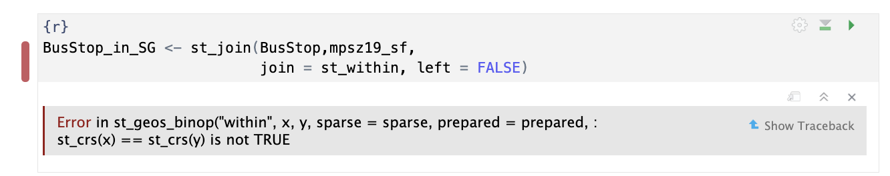

## Load Packages

```{r}
pacman::p_load(sf, tmap, tidyverse,knitr,sfdep,ggplot2)
```

## Import Data

### Import mpsz19

```{r}
mpsz19_sf <- read_rds("data/rds/mpsz.rds")
st_crs(mpsz19_sf)
```

```{r}
plot(mpsz19_sf)
```

### Import BusStop shap file

The code chunk below uses [`st_read()`](https://r-spatial.github.io/sf/reference/st_read.html) of **sf** package to import LTA Bus Stop into R. The imported shapefile will be **simple features** Object of **sf**.

```{r}
BusStop <- st_read(dsn = "data/LTADataMall", 
                 layer = "BusStop") 
#%>%
  #st_transform(crs = 3414)
st_crs(BusStop)
```

```{r}
plot(BusStop)
```

### Import CSV File

```{r}
odbus <-  read_csv("data/LTADataMall/origin_destination_bus_202508.csv")
```

```{r}
head(odbus,5)
```

```{r}
summary(odbus)
```

```{r}
tm_shape(mpsz19_sf)+
  tm_polygons()+
  tm_shape(BusStop)+
  tm_dots()+
  tm_layout(bg.color = "#f6f6f6",frame = FALSE)+
  tm_legend(frame = FALSE)
```

Notice there are several bus stops outside Singapore (JB)

```{r}

BusStop <- st_transform(BusStop,crs=3414)

BusStop_in_SG <- st_join(BusStop,mpsz19_sf,
                         join = st_within, left = FALSE)
```

::: callout-important


The error message indicates that the projected CRSs for BusStop & mpsz19_sf are different. Therefore, we need to transform the CRS of BusStop into 3414
:::

```{r}
tm_shape(mpsz19_sf)+
  tm_polygons()+
  tm_shape(BusStop_in_SG)+
  tm_dots()+
  tm_layout(bg.color = "#f6f6f6",frame = FALSE)+
  tm_legend(frame = FALSE)
```

Notice that the bus stops in JB have been removed!

## Derive Analytical Hexagon

```{r}
hexagon <- st_make_grid(mpsz19_sf,
                        cellsize = 700, # the radius is 700, for take-home 2 should be 375m
                        what = "polygon",
                        square = FALSE) %>% # won't form squares
  st_sf() # conver the result into sf table format

hexagon
```

The hexagon above contains only one column with polygon geometry, lacking an unique ID

### Filter hexagons with bus stops

The code below will return 0 or \>0. 0 means that their are bus stops within the hexagons.

```{r}
hexagon$n_collisions <-
  lengths(st_intersects(hexagon, BusStop_in_SG))

head(hexagon)
```

```{r}
hexagon <- filter(hexagon,n_collisions>0)
```

### Assign IDs to Each Hexagon

```{r}
hexagon <- hexagon %>%
  select(,-n_collisions) # "-" means drop the n_collisions column

hexagon$HEX_ID <- sprintf(
  "H%04d", seq_len(nrow(hexagon))) %>%
  as.factor()

kable(head(hexagon))
```

```{r}
tm_shape(mpsz19_sf)+
  tm_polygons()+
  tm_shape(hexagon)+
  tm_fill(col= "black",fill="green")+
  
  
  tm_layout(bg.color = "#f6f6f6",frame = FALSE)+
  tm_legend(frame = FALSE)
```

## Prepare Trip Generation Data

```{r}
trips <- odbus %>%
  select(c(ORIGIN_PT_CODE,DAY_TYPE,TIME_PER_HOUR,TOTAL_TRIPS)) %>%
  rename("BUS_STOP_N" = ORIGIN_PT_CODE) %>%
  rename("HOUR_OF_DAY" = TIME_PER_HOUR) %>%
  rename("TRIPS" = TOTAL_TRIPS)

trips$BUS_STOP_N <- as.factor(trips$BUS_STOP_N)
kable(head(trips))
```

```{r}
bus_hex <- st_intersection(
  BusStop, hexagon) %>%
  st_drop_geometry() %>%
  select(c(BUS_STOP_N, HEX_ID))

kable(head(bus_hex))
```

```{r}
trips <- inner_join(trips, bus_hex)
kable(head(trips))
```
