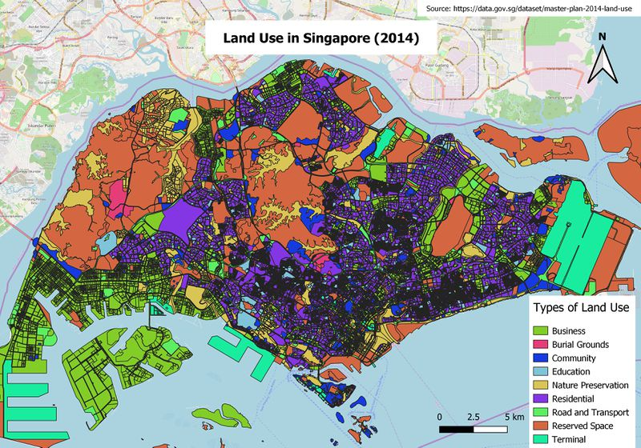

{fig-align="center" width="400"}

## 1 Welcome to my Geospatial Analytics

Hello there! I am Shubham and this is my homepage for [*ISSS626: Geospatial Analysis and Application*]{.underline}, a course taught by [Prof KAM Tin Seong at Singapore Management University]{.underline} as part of my [Master of IT in Business program (Data Science & Analytics)]{.underline}. This site showcases my coursework, where I apply a range of geospatial techniques to transform, visualize, and analyze spatial data in meaningful ways.

## 2 Course Overview

1.  Hands-on Exercise: Guided practice using R and public datasets to perform geospatial analysis.
2.  In-class Exercise: Builds on hands-on methods, focusing on data visualization and communication.
3.  Take-home Exercise: Integrates course concepts to tackle real-world spatial analysis challenges.

## [Hands-on Exercise](/Hands-on_Ex/)

::: {.listing id="hands_on"}
:::

## [In-class Exercise](/In-class_Ex/)

::: {.listing id="in_class"}
:::

## [Take-home Exercise](/Take-home_Ex/)

::: {.listing id="take-home"}
:::
